# Mermaid Sequence Diagrams: Frontend-to-Backend Features Flow

> This document maps the sequence of execution for all frontend features to the backend architecture as documented in `BACKEND-FEATURES-ANALYSIS.md`.

## Auth Entity

### User Registration (Signup)

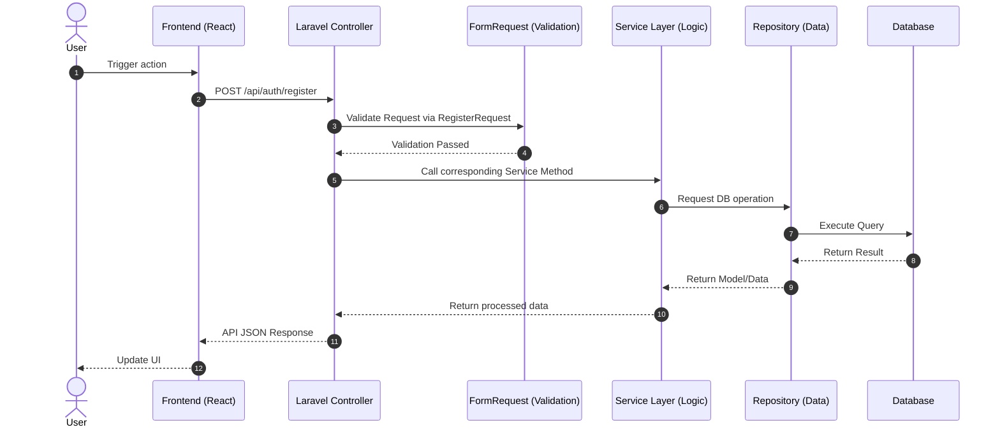

### User Login

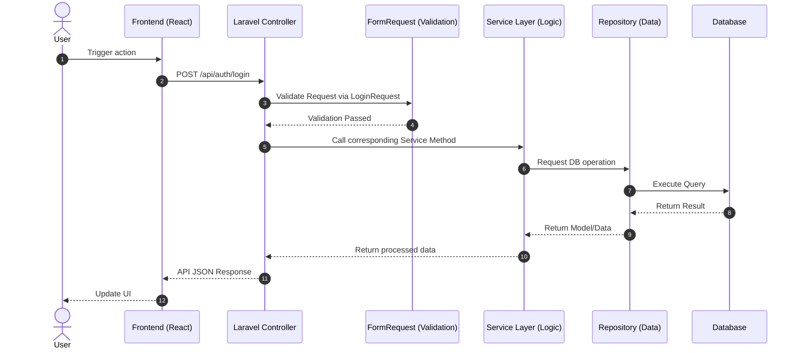

### Google OAuth Login

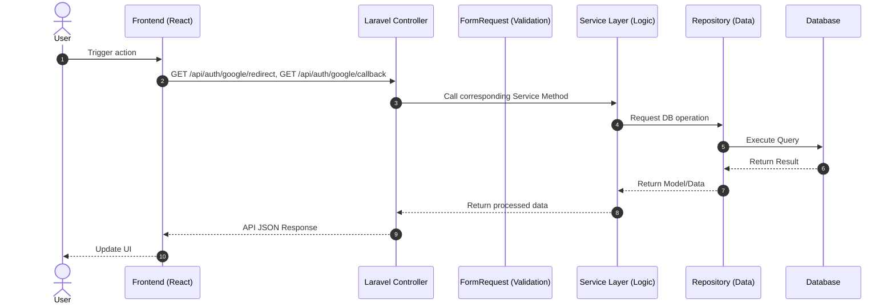

### Onboarding Wizard (Language & Interest Selection)

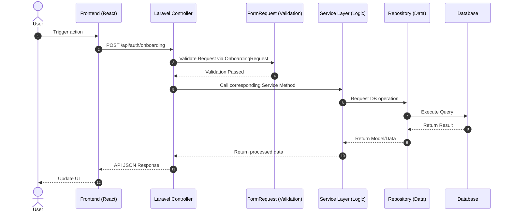

### User Logout

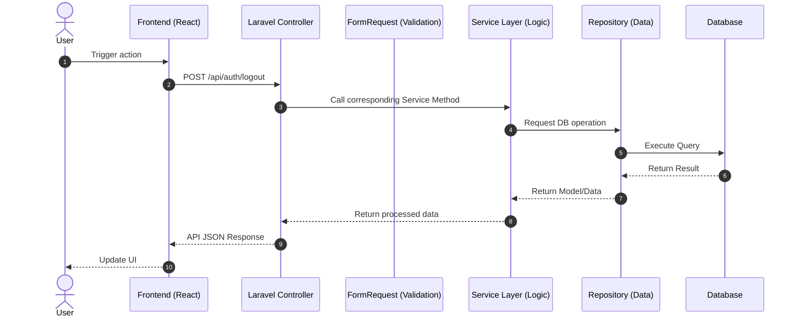

## Dashboard Entity

### Fetch Learning Analytics / Progress

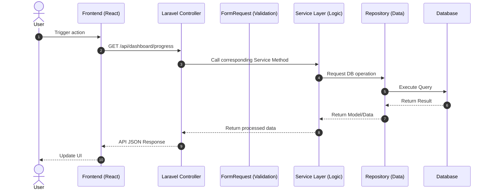

### Fetch Enrolled Courses with Progress

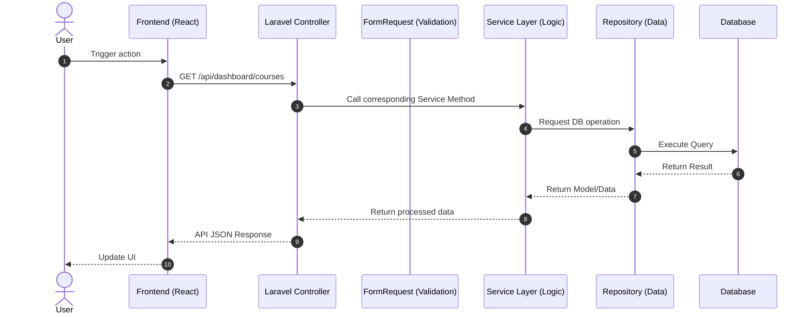

### Daily Check-In (Study Streak)


### Fetch Upcoming Meetings / Bookings

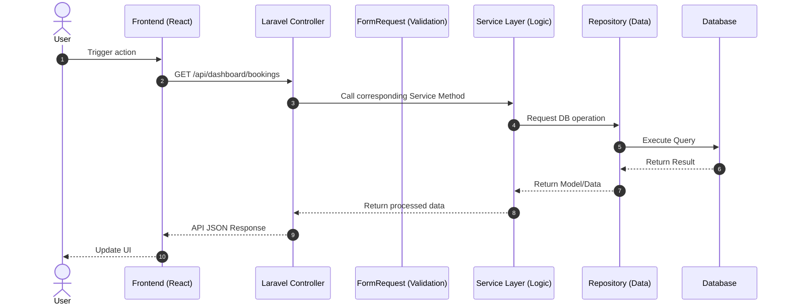

### Notifications CRUD

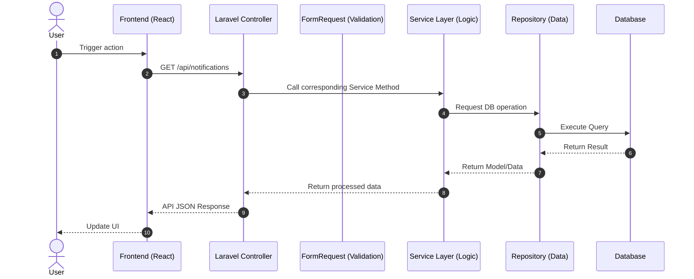

## Learning Entity

### List Instructors (with Filters)

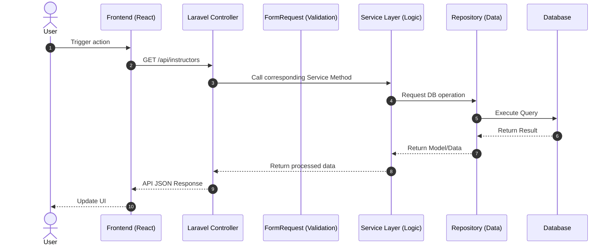

### View Instructor Profile

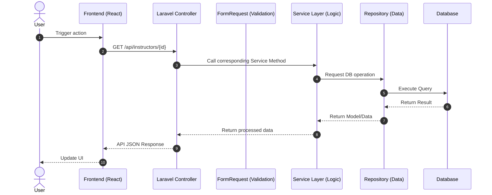

### Book Instructor Session

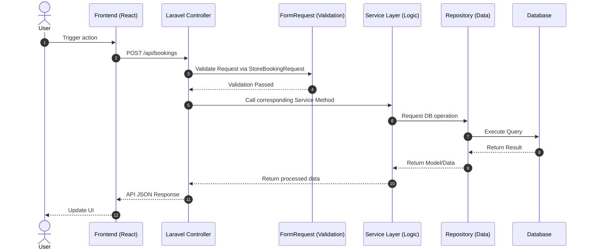

### List Lessons (with Filters)

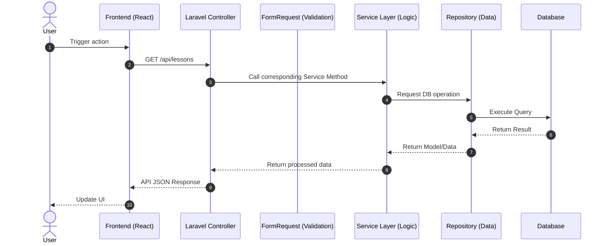

### View Course Details


### Enroll in Course

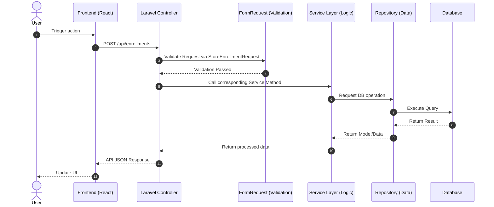

### Open Lesson Interface / Mark Lesson Complete

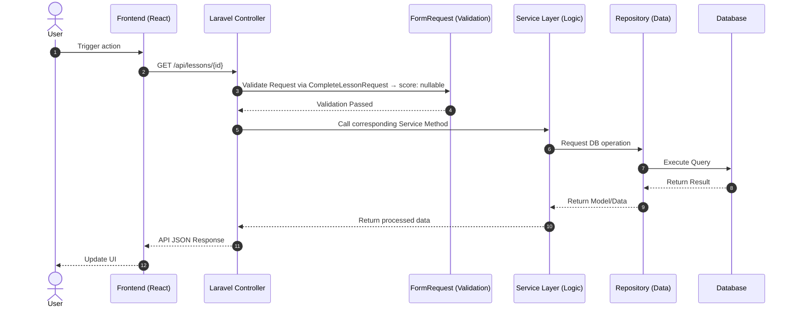

### Submit Quiz

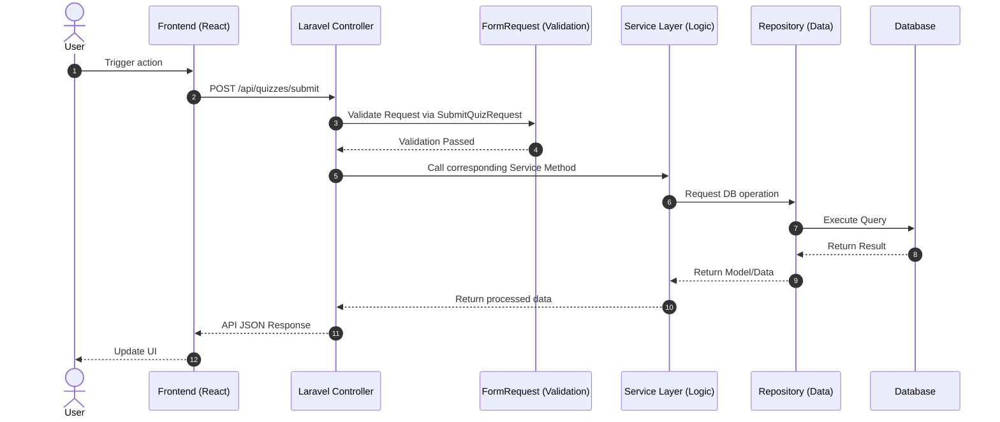

### Submit Instructor Review

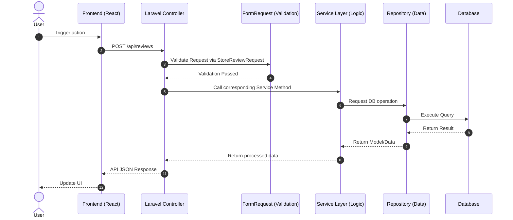

### Fetch Instructor Availability Slots

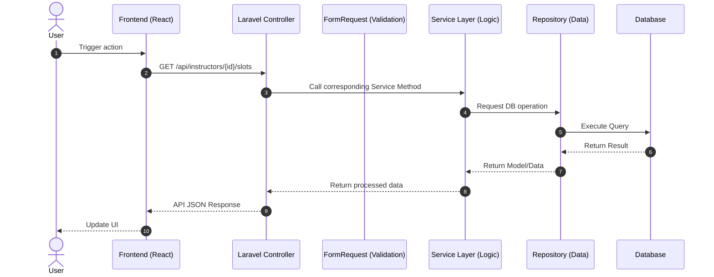

## Community Entity

### Fetch Moments Feed

```mermaid
sequenceDiagram
    autonumber
    actor User
    participant React as Frontend (React)
    participant Controller as Laravel Controller
    participant Request as FormRequest (Validation)
    participant Service as Service Layer (Logic)
    participant Repo as Repository (Data)
    participant DB as Database

    User->>React: Trigger action
    React->>Controller: GET /api/moments
    Controller->>Service: Call corresponding Service Method
    Service->>Repo: Request DB operation
    Repo->>DB: Execute Query
    DB-->>Repo: Return Result
    Repo-->>Service: Return Model/Data
    Service-->>Controller: Return processed data
    Controller-->>React: API JSON Response
    React-->>User: Update UI
```

### Create Moment (Post)

```mermaid
sequenceDiagram
    autonumber
    actor User
    participant React as Frontend (React)
    participant Controller as Laravel Controller
    participant Request as FormRequest (Validation)
    participant Service as Service Layer (Logic)
    participant Repo as Repository (Data)
    participant DB as Database

    User->>React: Trigger action
    React->>Controller: POST /api/moments
    Controller->>Request: Validate Request via StoreMomentRequest
    Request-->>Controller: Validation Passed
    Controller->>Service: Call corresponding Service Method
    Service->>Repo: Request DB operation
    Repo->>DB: Execute Query
    DB-->>Repo: Return Result
    Repo-->>Service: Return Model/Data
    Service-->>Controller: Return processed data
    Controller-->>React: API JSON Response
    React-->>User: Update UI
```

### Like / Unlike Moment

```mermaid
sequenceDiagram
    autonumber
    actor User
    participant React as Frontend (React)
    participant Controller as Laravel Controller
    participant Request as FormRequest (Validation)
    participant Service as Service Layer (Logic)
    participant Repo as Repository (Data)
    participant DB as Database

    User->>React: Trigger action
    React->>Controller: POST /api/moments/{id}/like
    Controller->>Service: Call corresponding Service Method
    Service->>Repo: Request DB operation
    Repo->>DB: Execute Query
    DB-->>Repo: Return Result
    Repo-->>Service: Return Model/Data
    Service-->>Controller: Return processed data
    Controller-->>React: API JSON Response
    React-->>User: Update UI
```

### Submit Grammar Correction on Moment

```mermaid
sequenceDiagram
    autonumber
    actor User
    participant React as Frontend (React)
    participant Controller as Laravel Controller
    participant Request as FormRequest (Validation)
    participant Service as Service Layer (Logic)
    participant Repo as Repository (Data)
    participant DB as Database

    User->>React: Trigger action
    React->>Controller: POST /api/moments/{id}/corrections
    Controller->>Request: Validate Request via StoreCorrectionRequest
    Request-->>Controller: Validation Passed
    Controller->>Service: Call corresponding Service Method
    Service->>Repo: Request DB operation
    Repo->>DB: Execute Query
    DB-->>Repo: Return Result
    Repo-->>Service: Return Model/Data
    Service-->>Controller: Return processed data
    Controller-->>React: API JSON Response
    React-->>User: Update UI
```

### Translate Moment

```mermaid
sequenceDiagram
    autonumber
    actor User
    participant React as Frontend (React)
    participant Controller as Laravel Controller
    participant Request as FormRequest (Validation)
    participant Service as Service Layer (Logic)
    participant Repo as Repository (Data)
    participant DB as Database

    User->>React: Trigger action
    React->>Controller: POST /api/translate
    Controller->>Request: Validate Request via TranslateRequest
    Request-->>Controller: Validation Passed
    Controller->>Service: Call corresponding Service Method
    Service->>Repo: Request DB operation
    Repo->>DB: Execute Query
    DB-->>Repo: Return Result
    Repo-->>Service: Return Model/Data
    Service-->>Controller: Return processed data
    Controller-->>React: API JSON Response
    React-->>User: Update UI
```

### Discover Language Partners

```mermaid
sequenceDiagram
    autonumber
    actor User
    participant React as Frontend (React)
    participant Controller as Laravel Controller
    participant Request as FormRequest (Validation)
    participant Service as Service Layer (Logic)
    participant Repo as Repository (Data)
    participant DB as Database

    User->>React: Trigger action
    React->>Controller: GET /api/users/discover
    Controller->>Service: Call corresponding Service Method
    Service->>Repo: Request DB operation
    Repo->>DB: Execute Query
    DB-->>Repo: Return Result
    Repo-->>Service: Return Model/Data
    Service-->>Controller: Return processed data
    Controller-->>React: API JSON Response
    React-->>User: Update UI
```

### Send Friend Request

```mermaid
sequenceDiagram
    autonumber
    actor User
    participant React as Frontend (React)
    participant Controller as Laravel Controller
    participant Request as FormRequest (Validation)
    participant Service as Service Layer (Logic)
    participant Repo as Repository (Data)
    participant DB as Database

    User->>React: Trigger action
    React->>Controller: POST /api/friend-requests
    Controller->>Request: Validate Request via StoreFriendRequest
    Request-->>Controller: Validation Passed
    Controller->>Service: Call corresponding Service Method
    Service->>Repo: Request DB operation
    Repo->>DB: Execute Query
    DB-->>Repo: Return Result
    Repo-->>Service: Return Model/Data
    Service-->>Controller: Return processed data
    Controller-->>React: API JSON Response
    React-->>User: Update UI
```

## Chat Entity

### Fetch Chat List

```mermaid
sequenceDiagram
    autonumber
    actor User
    participant React as Frontend (React)
    participant Controller as Laravel Controller
    participant Request as FormRequest (Validation)
    participant Service as Service Layer (Logic)
    participant Repo as Repository (Data)
    participant DB as Database

    User->>React: Trigger action
    React->>Controller: GET /api/chats
    Controller->>Service: Call corresponding Service Method
    Service->>Repo: Request DB operation
    Repo->>DB: Execute Query
    DB-->>Repo: Return Result
    Repo-->>Service: Return Model/Data
    Service-->>Controller: Return processed data
    Controller-->>React: API JSON Response
    React-->>User: Update UI
```

### Fetch Chat Messages

```mermaid
sequenceDiagram
    autonumber
    actor User
    participant React as Frontend (React)
    participant Controller as Laravel Controller
    participant Request as FormRequest (Validation)
    participant Service as Service Layer (Logic)
    participant Repo as Repository (Data)
    participant DB as Database

    User->>React: Trigger action
    React->>Controller: GET /api/chats/{id}/messages
    Controller->>Service: Call corresponding Service Method
    Service->>Repo: Request DB operation
    Repo->>DB: Execute Query
    DB-->>Repo: Return Result
    Repo-->>Service: Return Model/Data
    Service-->>Controller: Return processed data
    Controller-->>React: API JSON Response
    React-->>User: Update UI
```

### Send Message

```mermaid
sequenceDiagram
    autonumber
    actor User
    participant React as Frontend (React)
    participant Controller as Laravel Controller
    participant Request as FormRequest (Validation)
    participant Service as Service Layer (Logic)
    participant Repo as Repository (Data)
    participant DB as Database

    User->>React: Trigger action
    React->>Controller: POST /api/chats/{id}/messages
    Controller->>Request: Validate Request via StoreMessageRequest
    Request-->>Controller: Validation Passed
    Controller->>Service: Call corresponding Service Method
    Service->>Repo: Request DB operation
    Repo->>DB: Execute Query
    DB-->>Repo: Return Result
    Repo-->>Service: Return Model/Data
    Service-->>Controller: Return processed data
    Controller-->>React: API JSON Response
    React-->>User: Update UI
```

### Translate Chat Message

```mermaid
sequenceDiagram
    autonumber
    actor User
    participant React as Frontend (React)
    participant Controller as Laravel Controller
    participant Request as FormRequest (Validation)
    participant Service as Service Layer (Logic)
    participant Repo as Repository (Data)
    participant DB as Database

    User->>React: Trigger action
    React->>Controller: POST /api/translate
    Controller->>Service: Call corresponding Service Method
    Service->>Repo: Request DB operation
    Repo->>DB: Execute Query
    DB-->>Repo: Return Result
    Repo-->>Service: Return Model/Data
    Service-->>Controller: Return processed data
    Controller-->>React: API JSON Response
    React-->>User: Update UI
```

### Submit Chat Correction

```mermaid
sequenceDiagram
    autonumber
    actor User
    participant React as Frontend (React)
    participant Controller as Laravel Controller
    participant Request as FormRequest (Validation)
    participant Service as Service Layer (Logic)
    participant Repo as Repository (Data)
    participant DB as Database

    User->>React: Trigger action
    React->>Controller: POST /api/chats/{chatId}/messages/{msgId}/corrections
    Controller->>Request: Validate Request via StoreMessageCorrectionRequest
    Request-->>Controller: Validation Passed
    Controller->>Service: Call corresponding Service Method
    Service->>Repo: Request DB operation
    Repo->>DB: Execute Query
    DB-->>Repo: Return Result
    Repo-->>Service: Return Model/Data
    Service-->>Controller: Return processed data
    Controller-->>React: API JSON Response
    React-->>User: Update UI
```

### Create Group Chat

```mermaid
sequenceDiagram
    autonumber
    actor User
    participant React as Frontend (React)
    participant Controller as Laravel Controller
    participant Request as FormRequest (Validation)
    participant Service as Service Layer (Logic)
    participant Repo as Repository (Data)
    participant DB as Database

    User->>React: Trigger action
    React->>Controller: POST /api/chats/group
    Controller->>Request: Validate Request via StoreGroupChatRequest
    Request-->>Controller: Validation Passed
    Controller->>Service: Call corresponding Service Method
    Service->>Repo: Request DB operation
    Repo->>DB: Execute Query
    DB-->>Repo: Return Result
    Repo-->>Service: Return Model/Data
    Service-->>Controller: Return processed data
    Controller-->>React: API JSON Response
    React-->>User: Update UI
```

### Leave Group / Block User / Disband Group

```mermaid
sequenceDiagram
    autonumber
    actor User
    participant React as Frontend (React)
    participant Controller as Laravel Controller
    participant Request as FormRequest (Validation)
    participant Service as Service Layer (Logic)
    participant Repo as Repository (Data)
    participant DB as Database

    User->>React: Trigger action
    React->>Controller: POST /api/chats/{id}/leave
    Controller->>Service: Call corresponding Service Method
    Service->>Repo: Request DB operation
    Repo->>DB: Execute Query
    DB-->>Repo: Return Result
    Repo-->>Service: Return Model/Data
    Service-->>Controller: Return processed data
    Controller-->>React: API JSON Response
    React-->>User: Update UI
```

## Instructor Entity

### Dashboard Overview (Stats)

```mermaid
sequenceDiagram
    autonumber
    actor User
    participant React as Frontend (React)
    participant Controller as Laravel Controller
    participant Request as FormRequest (Validation)
    participant Service as Service Layer (Logic)
    participant Repo as Repository (Data)
    participant DB as Database

    User->>React: Trigger action
    React->>Controller: GET /api/instructor/dashboard
    Controller->>Service: Call corresponding Service Method
    Service->>Repo: Request DB operation
    Repo->>DB: Execute Query
    DB-->>Repo: Return Result
    Repo-->>Service: Return Model/Data
    Service-->>Controller: Return processed data
    Controller-->>React: API JSON Response
    React-->>User: Update UI
```

### CRUD Courses (Instructor's My Courses)

```mermaid
sequenceDiagram
    autonumber
    actor User
    participant React as Frontend (React)
    participant Controller as Laravel Controller
    participant Request as FormRequest (Validation)
    participant Service as Service Layer (Logic)
    participant Repo as Repository (Data)
    participant DB as Database

    User->>React: Trigger action
    React->>Controller: GET /api/instructor/courses
    Controller->>Request: Validate Request via StoreCourseRequest / UpdateCourseRequest
    Request-->>Controller: Validation Passed
    Controller->>Service: Call corresponding Service Method
    Service->>Repo: Request DB operation
    Repo->>DB: Execute Query
    DB-->>Repo: Return Result
    Repo-->>Service: Return Model/Data
    Service-->>Controller: Return processed data
    Controller-->>React: API JSON Response
    React-->>User: Update UI
```

### CRUD Lessons within a Course

```mermaid
    sequenceDiagram
        autonumber
        actor User
        participant React as Frontend (React)
        participant Controller as Laravel Controller
        participant Request as FormRequest (Validation)
        participant Service as Service Layer (Logic)
        participant Repo as Repository (Data)
        participant DB as Database

        User->>React: Trigger action
        React->>Controller: POST /api/instructor/courses/{courseId}/lessons
        Controller->>Request: Validate Request via StoreLessonRequest
        Request-->>Controller: Validation Passed
        Controller->>Service: Call corresponding Service Method
        Service->>Repo: Request DB operation
        Repo->>DB: Execute Query
        DB-->>Repo: Return Result
        Repo-->>Service: Return Model/Data
        Service-->>Controller: Return processed data
        Controller-->>React: API JSON Response
        React-->>User: Update UI
```

### CRUD Lesson Materials

```mermaid
sequenceDiagram
    autonumber
    actor User
    participant React as Frontend (React)
    participant Controller as Laravel Controller
    participant Request as FormRequest (Validation)
    participant Service as Service Layer (Logic)
    participant Repo as Repository (Data)
    participant DB as Database

    User->>React: Trigger action
    React->>Controller: POST /api/instructor/lessons/{lessonId}/materials
    Controller->>Request: Validate Request via StoreMaterialRequest
    Request-->>Controller: Validation Passed
    Controller->>Service: Call corresponding Service Method
    Service->>Repo: Request DB operation
    Repo->>DB: Execute Query
    DB-->>Repo: Return Result
    Repo-->>Service: Return Model/Data
    Service-->>Controller: Return processed data
    Controller-->>React: API JSON Response
    React-->>User: Update UI
```

### CRUD Quiz Questions

```mermaid
sequenceDiagram
    autonumber
    actor User
    participant React as Frontend (React)
    participant Controller as Laravel Controller
    participant Request as FormRequest (Validation)
    participant Service as Service Layer (Logic)
    participant Repo as Repository (Data)
    participant DB as Database

    User->>React: Trigger action
    React->>Controller: GET /api/instructor/courses/{courseId}/quizzes
    Controller->>Request: Validate Request via StoreQuizQuestionRequest
    Request-->>Controller: Validation Passed
    Controller->>Service: Call corresponding Service Method
    Service->>Repo: Request DB operation
    Repo->>DB: Execute Query
    DB-->>Repo: Return Result
    Repo-->>Service: Return Model/Data
    Service-->>Controller: Return processed data
    Controller-->>React: API JSON Response
    React-->>User: Update UI
```

### View Student Feedback

```mermaid
sequenceDiagram
    autonumber
    actor User
    participant React as Frontend (React)
    participant Controller as Laravel Controller
    participant Request as FormRequest (Validation)
    participant Service as Service Layer (Logic)
    participant Repo as Repository (Data)
    participant DB as Database

    User->>React: Trigger action
    React->>Controller: GET /api/instructor/feedback
    Controller->>Service: Call corresponding Service Method
    Service->>Repo: Request DB operation
    Repo->>DB: Execute Query
    DB-->>Repo: Return Result
    Repo-->>Service: Return Model/Data
    Service-->>Controller: Return processed data
    Controller-->>React: API JSON Response
    React-->>User: Update UI
```

### View Ratings & Reviews

```mermaid
sequenceDiagram
    autonumber
    actor User
    participant React as Frontend (React)
    participant Controller as Laravel Controller
    participant Request as FormRequest (Validation)
    participant Service as Service Layer (Logic)
    participant Repo as Repository (Data)
    participant DB as Database

    User->>React: Trigger action
    React->>Controller: GET /api/instructor/reviews
    Controller->>Service: Call corresponding Service Method
    Service->>Repo: Request DB operation
    Repo->>DB: Execute Query
    DB-->>Repo: Return Result
    Repo-->>Service: Return Model/Data
    Service-->>Controller: Return processed data
    Controller-->>React: API JSON Response
    React-->>User: Update UI
```

### Manage Availability Slots

```mermaid
sequenceDiagram
    autonumber
    actor User
    participant React as Frontend (React)
    participant Controller as Laravel Controller
    participant Request as FormRequest (Validation)
    participant Service as Service Layer (Logic)
    participant Repo as Repository (Data)
    participant DB as Database

    User->>React: Trigger action
    React->>Controller: GET /api/instructor/slots
    Controller->>Request: Validate Request via StoreSlotRequest
    Request-->>Controller: Validation Passed
    Controller->>Service: Call corresponding Service Method
    Service->>Repo: Request DB operation
    Repo->>DB: Execute Query
    DB-->>Repo: Return Result
    Repo-->>Service: Return Model/Data
    Service-->>Controller: Return processed data
    Controller-->>React: API JSON Response
    React-->>User: Update UI
```

### Manage Assessments

```mermaid
sequenceDiagram
    autonumber
    actor User
    participant React as Frontend (React)
    participant Controller as Laravel Controller
    participant Request as FormRequest (Validation)
    participant Service as Service Layer (Logic)
    participant Repo as Repository (Data)
    participant DB as Database

    User->>React: Trigger action
    React->>Controller: GET /api/instructor/assessments
    Controller->>Service: Call corresponding Service Method
    Service->>Repo: Request DB operation
    Repo->>DB: Execute Query
    DB-->>Repo: Return Result
    Repo-->>Service: Return Model/Data
    Service-->>Controller: Return processed data
    Controller-->>React: API JSON Response
    React-->>User: Update UI
```

### Manage Learning Groups

```mermaid
sequenceDiagram
    autonumber
    actor User
    participant React as Frontend (React)
    participant Controller as Laravel Controller
    participant Request as FormRequest (Validation)
    participant Service as Service Layer (Logic)
    participant Repo as Repository (Data)
    participant DB as Database

    User->>React: Trigger action
    React->>Controller: GET /api/instructor/groups
    Controller->>Request: Validate Request via StoreGroupRequest
    Request-->>Controller: Validation Passed
    Controller->>Service: Call corresponding Service Method
    Service->>Repo: Request DB operation
    Repo->>DB: Execute Query
    DB-->>Repo: Return Result
    Repo-->>Service: Return Model/Data
    Service-->>Controller: Return processed data
    Controller-->>React: API JSON Response
    React-->>User: Update UI
```

## Media Entity (Podcasts)

### List Podcasts

```mermaid
sequenceDiagram
    autonumber
    actor User
    participant React as Frontend (React)
    participant Controller as Laravel Controller
    participant Request as FormRequest (Validation)
    participant Service as Service Layer (Logic)
    participant Repo as Repository (Data)
    participant DB as Database

    User->>React: Trigger action
    React->>Controller: GET /api/podcasts
    Controller->>Service: Call corresponding Service Method
    Service->>Repo: Request DB operation
    Repo->>DB: Execute Query
    DB-->>Repo: Return Result
    Repo-->>Service: Return Model/Data
    Service-->>Controller: Return processed data
    Controller-->>React: API JSON Response
    React-->>User: Update UI
```

### Upload Podcast (Instructor Only)

```mermaid
sequenceDiagram
    autonumber
    actor User
    participant React as Frontend (React)
    participant Controller as Laravel Controller
    participant Request as FormRequest (Validation)
    participant Service as Service Layer (Logic)
    participant Repo as Repository (Data)
    participant DB as Database

    User->>React: Trigger action
    React->>Controller: POST /api/podcasts
    Controller->>Request: Validate Request via StorePodcastRequest
    Request-->>Controller: Validation Passed
    Controller->>Service: Call corresponding Service Method
    Service->>Repo: Request DB operation
    Repo->>DB: Execute Query
    DB-->>Repo: Return Result
    Repo-->>Service: Return Model/Data
    Service-->>Controller: Return processed data
    Controller-->>React: API JSON Response
    React-->>User: Update UI
```

### Update Podcast (Instructor Only)

```mermaid
sequenceDiagram
    autonumber
    actor User
    participant React as Frontend (React)
    participant Controller as Laravel Controller
    participant Request as FormRequest (Validation)
    participant Service as Service Layer (Logic)
    participant Repo as Repository (Data)
    participant DB as Database

    User->>React: Trigger action
    React->>Controller: PUT /api/podcasts/{id}
    Controller->>Request: Validate Request via UpdatePodcastRequest
    Request-->>Controller: Validation Passed
    Controller->>Service: Call corresponding Service Method
    Service->>Repo: Request DB operation
    Repo->>DB: Execute Query
    DB-->>Repo: Return Result
    Repo-->>Service: Return Model/Data
    Service-->>Controller: Return processed data
    Controller-->>React: API JSON Response
    React-->>User: Update UI
```

### Delete Podcast (Instructor Only)

```mermaid
sequenceDiagram
    autonumber
    actor User
    participant React as Frontend (React)
    participant Controller as Laravel Controller
    participant Request as FormRequest (Validation)
    participant Service as Service Layer (Logic)
    participant Repo as Repository (Data)
    participant DB as Database

    User->>React: Trigger action
    React->>Controller: DELETE /api/podcasts/{id}
    Controller->>Service: Call corresponding Service Method
    Service->>Repo: Request DB operation
    Repo->>DB: Execute Query
    DB-->>Repo: Return Result
    Repo-->>Service: Return Model/Data
    Service-->>Controller: Return processed data
    Controller-->>React: API JSON Response
    React-->>User: Update UI
```

## Certificates Entity

### List My Certificates

```mermaid
sequenceDiagram
    autonumber
    actor User
    participant React as Frontend (React)
    participant Controller as Laravel Controller
    participant Request as FormRequest (Validation)
    participant Service as Service Layer (Logic)
    participant Repo as Repository (Data)
    participant DB as Database

    User->>React: Trigger action
    React->>Controller: GET /api/certificates
    Controller->>Service: Call corresponding Service Method
    Service->>Repo: Request DB operation
    Repo->>DB: Execute Query
    DB-->>Repo: Return Result
    Repo-->>Service: Return Model/Data
    Service-->>Controller: Return processed data
    Controller-->>React: API JSON Response
    React-->>User: Update UI
```

### Download Certificate PDF

```mermaid
sequenceDiagram
    autonumber
    actor User
    participant React as Frontend (React)
    participant Controller as Laravel Controller
    participant Request as FormRequest (Validation)
    participant Service as Service Layer (Logic)
    participant Repo as Repository (Data)
    participant DB as Database

    User->>React: Trigger action
    React->>Controller: GET /api/certificates/{id}/download
    Controller->>Service: Call corresponding Service Method
    Service->>Repo: Request DB operation
    Repo->>DB: Execute Query
    DB-->>Repo: Return Result
    Repo-->>Service: Return Model/Data
    Service-->>Controller: Return processed data
    Controller-->>React: API JSON Response
    React-->>User: Update UI
```

### Verify Certificate (Public)

```mermaid
sequenceDiagram
    autonumber
    actor User
    participant React as Frontend (React)
    participant Controller as Laravel Controller
    participant Request as FormRequest (Validation)
    participant Service as Service Layer (Logic)
    participant Repo as Repository (Data)
    participant DB as Database

    User->>React: Trigger action
    React->>Controller: GET /api/certificates/verify/{code}
    Controller->>Service: Call corresponding Service Method
    Service->>Repo: Request DB operation
    Repo->>DB: Execute Query
    DB-->>Repo: Return Result
    Repo-->>Service: Return Model/Data
    Service-->>Controller: Return processed data
    Controller-->>React: API JSON Response
    React-->>User: Update UI
```

## Problems Entity

### List Translation Problems

```mermaid
sequenceDiagram
    autonumber
    actor User
    participant React as Frontend (React)
    participant Controller as Laravel Controller
    participant Request as FormRequest (Validation)
    participant Service as Service Layer (Logic)
    participant Repo as Repository (Data)
    participant DB as Database

    User->>React: Trigger action
    React->>Controller: GET /api/problems
    Controller->>Service: Call corresponding Service Method
    Service->>Repo: Request DB operation
    Repo->>DB: Execute Query
    DB-->>Repo: Return Result
    Repo-->>Service: Return Model/Data
    Service-->>Controller: Return processed data
    Controller-->>React: API JSON Response
    React-->>User: Update UI
```

### Create Problem

```mermaid
sequenceDiagram
    autonumber
    actor User
    participant React as Frontend (React)
    participant Controller as Laravel Controller
    participant Request as FormRequest (Validation)
    participant Service as Service Layer (Logic)
    participant Repo as Repository (Data)
    participant DB as Database

    User->>React: Trigger action
    React->>Controller: POST /api/problems
    Controller->>Request: Validate Request via StoreProblemRequest
    Request-->>Controller: Validation Passed
    Controller->>Service: Call corresponding Service Method
    Service->>Repo: Request DB operation
    Repo->>DB: Execute Query
    DB-->>Repo: Return Result
    Repo-->>Service: Return Model/Data
    Service-->>Controller: Return processed data
    Controller-->>React: API JSON Response
    React-->>User: Update UI
```

### Edit Problem (Instructor Only)

```mermaid
sequenceDiagram
    autonumber
    actor User
    participant React as Frontend (React)
    participant Controller as Laravel Controller
    participant Request as FormRequest (Validation)
    participant Service as Service Layer (Logic)
    participant Repo as Repository (Data)
    participant DB as Database

    User->>React: Trigger action
    React->>Controller: PUT /api/problems/{id}
    Controller->>Request: Validate Request via UpdateProblemRequest
    Request-->>Controller: Validation Passed
    Controller->>Service: Call corresponding Service Method
    Service->>Repo: Request DB operation
    Repo->>DB: Execute Query
    DB-->>Repo: Return Result
    Repo-->>Service: Return Model/Data
    Service-->>Controller: Return processed data
    Controller-->>React: API JSON Response
    React-->>User: Update UI
```

### Delete Problem (Instructor Only)

```mermaid
sequenceDiagram
    autonumber
    actor User
    participant React as Frontend (React)
    participant Controller as Laravel Controller
    participant Request as FormRequest (Validation)
    participant Service as Service Layer (Logic)
    participant Repo as Repository (Data)
    participant DB as Database

    User->>React: Trigger action
    React->>Controller: DELETE /api/problems/{id}
    Controller->>Service: Call corresponding Service Method
    Service->>Repo: Request DB operation
    Repo->>DB: Execute Query
    DB-->>Repo: Return Result
    Repo-->>Service: Return Model/Data
    Service-->>Controller: Return processed data
    Controller-->>React: API JSON Response
    React-->>User: Update UI
```

### Upvote Problem

```mermaid
sequenceDiagram
    autonumber
    actor User
    participant React as Frontend (React)
    participant Controller as Laravel Controller
    participant Request as FormRequest (Validation)
    participant Service as Service Layer (Logic)
    participant Repo as Repository (Data)
    participant DB as Database

    User->>React: Trigger action
    React->>Controller: POST /api/problems/{id}/upvote
    Controller->>Service: Call corresponding Service Method
    Service->>Repo: Request DB operation
    Repo->>DB: Execute Query
    DB-->>Repo: Return Result
    Repo-->>Service: Return Model/Data
    Service-->>Controller: Return processed data
    Controller-->>React: API JSON Response
    React-->>User: Update UI
```

### Comment on Problem

```mermaid
sequenceDiagram
    autonumber
    actor User
    participant React as Frontend (React)
    participant Controller as Laravel Controller
    participant Request as FormRequest (Validation)
    participant Service as Service Layer (Logic)
    participant Repo as Repository (Data)
    participant DB as Database

    User->>React: Trigger action
    React->>Controller: POST /api/problems/{id}/comments
    Controller->>Request: Validate Request via StoreProblemCommentRequest
    Request-->>Controller: Validation Passed
    Controller->>Service: Call corresponding Service Method
    Service->>Repo: Request DB operation
    Repo->>DB: Execute Query
    DB-->>Repo: Return Result
    Repo-->>Service: Return Model/Data
    Service-->>Controller: Return processed data
    Controller-->>React: API JSON Response
    React-->>User: Update UI
```

## Profile Entity

### Fetch My Profile

```mermaid
sequenceDiagram
    autonumber
    actor User
    participant React as Frontend (React)
    participant Controller as Laravel Controller
    participant Request as FormRequest (Validation)
    participant Service as Service Layer (Logic)
    participant Repo as Repository (Data)
    participant DB as Database

    User->>React: Trigger action
    React->>Controller: GET /api/profile
    Controller->>Service: Call corresponding Service Method
    Service->>Repo: Request DB operation
    Repo->>DB: Execute Query
    DB-->>Repo: Return Result
    Repo-->>Service: Return Model/Data
    Service-->>Controller: Return processed data
    Controller-->>React: API JSON Response
    React-->>User: Update UI
```

### Update Profile Field

```mermaid
sequenceDiagram
    autonumber
    actor User
    participant React as Frontend (React)
    participant Controller as Laravel Controller
    participant Request as FormRequest (Validation)
    participant Service as Service Layer (Logic)
    participant Repo as Repository (Data)
    participant DB as Database

    User->>React: Trigger action
    React->>Controller: PATCH /api/profile
    Controller->>Request: Validate Request via UpdateProfileRequest
    Request-->>Controller: Validation Passed
    Controller->>Service: Call corresponding Service Method
    Service->>Repo: Request DB operation
    Repo->>DB: Execute Query
    DB-->>Repo: Return Result
    Repo-->>Service: Return Model/Data
    Service-->>Controller: Return processed data
    Controller-->>React: API JSON Response
    React-->>User: Update UI
```

### Change Avatar

```mermaid
sequenceDiagram
    autonumber
    actor User
    participant React as Frontend (React)
    participant Controller as Laravel Controller
    participant Request as FormRequest (Validation)
    participant Service as Service Layer (Logic)
    participant Repo as Repository (Data)
    participant DB as Database

    User->>React: Trigger action
    React->>Controller: POST /api/profile/avatar
    Controller->>Request: Validate Request via UpdateAvatarRequest
    Request-->>Controller: Validation Passed
    Controller->>Service: Call corresponding Service Method
    Service->>Repo: Request DB operation
    Repo->>DB: Execute Query
    DB-->>Repo: Return Result
    Repo-->>Service: Return Model/Data
    Service-->>Controller: Return processed data
    Controller-->>React: API JSON Response
    React-->>User: Update UI
```

### Post Moment from Profile

```mermaid
sequenceDiagram
    autonumber
    actor User
    participant React as Frontend (React)
    participant Controller as Laravel Controller
    participant Request as FormRequest (Validation)
    participant Service as Service Layer (Logic)
    participant Repo as Repository (Data)
    participant DB as Database

    User->>React: Trigger action
    React->>Controller: POST /api/moments (same as Feature 4.2)
    Controller->>Service: Call corresponding Service Method
    Service->>Repo: Request DB operation
    Repo->>DB: Execute Query
    DB-->>Repo: Return Result
    Repo-->>Service: Return Model/Data
    Service-->>Controller: Return processed data
    Controller-->>React: API JSON Response
    React-->>User: Update UI
```

### Delete Own Moment

```mermaid
sequenceDiagram
    autonumber
    actor User
    participant React as Frontend (React)
    participant Controller as Laravel Controller
    participant Request as FormRequest (Validation)
    participant Service as Service Layer (Logic)
    participant Repo as Repository (Data)
    participant DB as Database

    User->>React: Trigger action
    React->>Controller: DELETE /api/moments/{id}
    Controller->>Service: Call corresponding Service Method
    Service->>Repo: Request DB operation
    Repo->>DB: Execute Query
    DB-->>Repo: Return Result
    Repo-->>Service: Return Model/Data
    Service-->>Controller: Return processed data
    Controller-->>React: API JSON Response
    React-->>User: Update UI
```

### Profile Settings (Account Management)

```mermaid
sequenceDiagram
    autonumber
    actor User
    participant React as Frontend (React)
    participant Controller as Laravel Controller
    participant Request as FormRequest (Validation)
    participant Service as Service Layer (Logic)
    participant Repo as Repository (Data)
    participant DB as Database

    User->>React: Trigger action
    React->>Controller: PUT /api/profile/password
    Controller->>Request: Validate Request via ChangePasswordRequest → current_password: required, new_password: required
    Request-->>Controller: Validation Passed
    Controller->>Service: Call corresponding Service Method
    Service->>Repo: Request DB operation
    Repo->>DB: Execute Query
    DB-->>Repo: Return Result
    Repo-->>Service: Return Model/Data
    Service-->>Controller: Return processed data
    Controller-->>React: API JSON Response
    React-->>User: Update UI
```

### Manage Subscription

```mermaid
sequenceDiagram
    autonumber
    actor User
    participant React as Frontend (React)
    participant Controller as Laravel Controller
    participant Request as FormRequest (Validation)
    participant Service as Service Layer (Logic)
    participant Repo as Repository (Data)
    participant DB as Database

    User->>React: Trigger action
    React->>Controller: GET /api/subscription
    Controller->>Request: Validate Request via StoreSubscriptionRequest → plan: required
    Request-->>Controller: Validation Passed
    Controller->>Service: Call corresponding Service Method
    Service->>Repo: Request DB operation
    Repo->>DB: Execute Query
    DB-->>Repo: Return Result
    Repo-->>Service: Return Model/Data
    Service-->>Controller: Return processed data
    Controller-->>React: API JSON Response
    React-->>User: Update UI
```

## Guest Entity

### Landing Page Data

```mermaid
sequenceDiagram
    autonumber
    actor User
    participant React as Frontend (React)
    participant Controller as Laravel Controller
    participant Request as FormRequest (Validation)
    participant Service as Service Layer (Logic)
    participant Repo as Repository (Data)
    participant DB as Database

    User->>React: Trigger action
    React->>Controller: GET /api/public/stats
    Controller->>Service: Call corresponding Service Method
    Service->>Repo: Request DB operation
    Repo->>DB: Execute Query
    DB-->>Repo: Return Result
    Repo-->>Service: Return Model/Data
    Service-->>Controller: Return processed data
    Controller-->>React: API JSON Response
    React-->>User: Update UI
```

### Public Course Catalog

```mermaid
sequenceDiagram
    autonumber
    actor User
    participant React as Frontend (React)
    participant Controller as Laravel Controller
    participant Request as FormRequest (Validation)
    participant Service as Service Layer (Logic)
    participant Repo as Repository (Data)
    participant DB as Database

    User->>React: Trigger action
    React->>Controller: GET /api/public/courses
    Controller->>Service: Call corresponding Service Method
    Service->>Repo: Request DB operation
    Repo->>DB: Execute Query
    DB-->>Repo: Return Result
    Repo-->>Service: Return Model/Data
    Service-->>Controller: Return processed data
    Controller-->>React: API JSON Response
    React-->>User: Update UI
```

## Global / Shared Features

### Translation API (Shared)

```mermaid
sequenceDiagram
    autonumber
    actor User
    participant React as Frontend (React)
    participant Controller as Laravel Controller
    participant Request as FormRequest (Validation)
    participant Service as Service Layer (Logic)
    participant Repo as Repository (Data)
    participant DB as Database

    User->>React: Trigger action
    React->>Controller: POST /api/translate
    Controller->>Request: Validate Request via TranslateRequest
    Request-->>Controller: Validation Passed
    Controller->>Service: Call corresponding Service Method
    Service->>Repo: Request DB operation
    Repo->>DB: Execute Query
    DB-->>Repo: Return Result
    Repo-->>Service: Return Model/Data
    Service-->>Controller: Return processed data
    Controller-->>React: API JSON Response
    React-->>User: Update UI
```

### File Upload Handler (Shared)

```mermaid
sequenceDiagram
    autonumber
    actor User
    participant React as Frontend (React)
    participant Controller as Laravel Controller
    participant Request as FormRequest (Validation)
    participant Service as Service Layer (Logic)
    participant Repo as Repository (Data)
    participant DB as Database

    User->>React: Trigger action
    React->>Controller: API Request
    Controller->>Service: Call corresponding Service Method
    Service->>Repo: Request DB operation
    Repo->>DB: Execute Query
    DB-->>Repo: Return Result
    Repo-->>Service: Return Model/Data
    Service-->>Controller: Return processed data
    Controller-->>React: API JSON Response
    React-->>User: Update UI
```

### Notification System (Shared)

```mermaid
sequenceDiagram
    autonumber
    actor User
    participant React as Frontend (React)
    participant Controller as Laravel Controller
    participant Request as FormRequest (Validation)
    participant Service as Service Layer (Logic)
    participant Repo as Repository (Data)
    participant DB as Database

    User->>React: Trigger action
    React->>Controller: API Request
    Controller->>Service: Call corresponding Service Method
    Service->>Repo: Request DB operation
    Repo->>DB: Execute Query
    DB-->>Repo: Return Result
    Repo-->>Service: Return Model/Data
    Service-->>Controller: Return processed data
    Controller-->>React: API JSON Response
    React-->>User: Update UI
```

