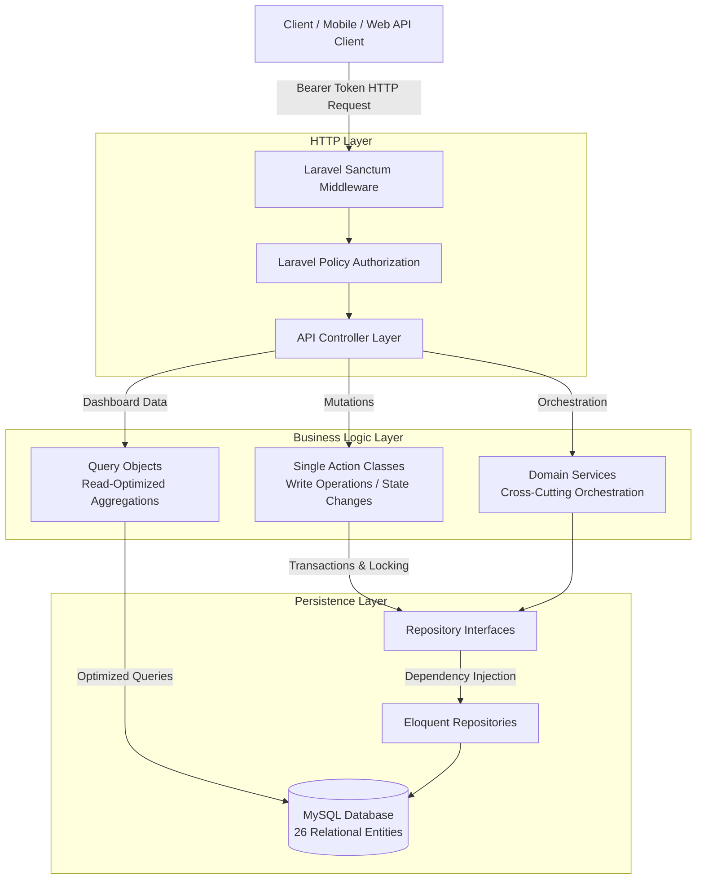

# LinguaFlow — Language Learning & Peer Translation API

> **Clean Architecture • Domain Complexity • High-Concurrency Backend API**

LinguaFlow is a specialized **Language-Learning Ecosystem & Peer Translation Backend API** built with Laravel 13, PHP 8.3, and MySQL. It bridges self-paced course progression, synchronous instructor session booking with pessimistic concurrency control, peer-to-peer grammar corrections, and dynamic language partner matching across 26 interconnected domain entities.

---

## ⚡ 30-Second Recruiter Summary

LinguaFlow was designed to showcase **production-grade backend architecture** for complex multi-sided platforms. Rather than relying on simple CRUD controllers, LinguaFlow enforces strict separation of concerns through:

- **Single Action Classes**: Isolated write-side business operations encapsulated in atomic database transactions (`DB::transaction`).
- **Command/Query Responsibility Separation (CQRS-lite)**: Dedicated Query Objects for heavy data aggregation, keeping read paths separate from domain mutation logic.
- **Interface-Driven Repository Pattern**: 26 domain repositories backed by explicit PHP contracts and bound in a central `RepositoryServiceProvider` for testability and storage abstraction.
- **Pessimistic Concurrency Management**: Row-level locking (`lockForUpdate()`) to eliminate double-booking race conditions during instructor slot reservations.
- **Fine-Grained Policy Authorization**: Decoupled access control via Laravel Policies and Sanctum API authentication.

---

## 🎯 Business Problem & Core Capabilities

Multi-sided learning ecosystems require managing conflicting domain constraints: real-time scheduling concurrency, stateful progress tracking, multi-role security (Students, Instructors, Admins), and social community loops. LinguaFlow solves these challenges via four primary modules:

1. **Self-Paced Learning Engine**: Course cataloging, lesson progression tracking, interactive quiz evaluations, and automated certificate generation upon 100% completion.
2. **Instructor Scheduling & Booking**: Private and group session booking with dynamic price calculations (group discounts, course bundle multipliers) and slot availability locking.
3. **Peer Community & Corrections**: "Moments" feed where learners post text snippets and peers submit line-by-line grammar corrections and feedback.
4. **Partner Matching & Messaging**: Cross-lingual exchange matching algorithm connecting students based on complementary native/learning languages and shared interests.

---

## 🏗️ Architecture Overview

LinguaFlow follows a multi-layered API architecture that isolates HTTP controllers from business rules, data persistence, and read-side aggregations.



---

## 🔑 Key Engineering Workflows & Design Decisions

### 1. Pessimistic Concurrency Locking (Booking Sessions)
- **Challenge**: Preventing concurrent double-booking when multiple students attempt to reserve the exact same instructor slot simultaneously.
- **Implementation**: `BookInstructorSessionAction` wraps slot validation and booking creation inside an atomic `DB::transaction` and uses Eloquent's `lockForUpdate()` on `InstructorSlot`.
- **Engineering Signal**: Prevents race conditions at the database level rather than relying on application-level checks.

### 2. Event-Driven Progression & Auto-Certificates
- **Challenge**: Accurately calculating student course progress, maintaining current lesson pointers, and issuing completion awards without duplicating logic.
- **Implementation**: `CompleteLessonAction` atomically calculates completed lesson ratios, advances the student's `current_lesson_id` to the next ordered lesson, updates enrollment state, and auto-generates a cryptographically unique `Certificate` upon reaching 100% completion.

### 3. Cross-Language Matching Algorithm
- **Challenge**: Recommending relevant language partners out of large student pools based on complementary learning goals.
- **Implementation**: `DiscoverLanguagePartnersAction` filters candidates using a dual-way language bridge (User A native language matches User B learning language, or vice versa) and applies a dynamic scoring matrix based on shared interests (+10% match per shared interest, capped at 99%).

### 4. Read-Side Query Objects (CQRS-lite)
- **Challenge**: Complex analytics dashboards (Instructor earnings, active enrollment heatmaps, pending session requests) bloated controllers and mixed query logic with business actions.
- **Implementation**: Standalone Query Objects (`StudentDashboardQuery`, `InstructorDashboardQuery`) construct optimized SQL reads directly returning formatted dashboard structures.

---

## 📊 Domain Model & Data Complexity

The backend models **26 interconnected domain entities** with enforced foreign key integrity and indexes:

| Domain Area | Models | Key Responsibilities |
| :--- | :--- | :--- |
| **Identity & Access** | `User`, `UserLanguage`, `UserInterest` | Roles (`student`, `instructor`, `admin`), CEFR levels, native/learning languages. |
| **Instruction & Booking** | `Instructor`, `InstructorSlot`, `Booking` | Slot scheduling, hourly pricing, session status (`pending`, `confirmed`, `cancelled`). |
| **Learning & Progression** | `Course`, `Lesson`, `LessonCompletion`, `Enrollment`, `Certificate` | Ordered lesson paths, completion tracking, percentage progress, certificate numbers. |
| **Assessment & Content** | `QuizQuestion`, `QuizResult`, `LessonMaterial`, `Podcast` | Quiz scoring logic, downloadable course assets. |
| **Community & Peer Exchange** | `Moment`, `MomentCorrection`, `MomentComment`, `MomentLike` | Social post creation, peer grammar corrections, likes, comments. |
| **Messaging & Support** | `Chat`, `ChatMember`, `Message`, `Notification`, `Subscription`, `Review` | Direct messaging, internal notifications, tier subscriptions, instructor reviews. |

---

## 🔐 Authentication, Authorization & Security

- **Token Authentication**: Authenticated endpoints utilize **Laravel Sanctum** bearer tokens issued via `AuthService`.
- **Role Middleware**: Administrative and instructor routes are protected using custom role middleware (`role:instructor,admin`).
- **Policy Enforcement**: Granular action authorization is delegated to dedicated Policy classes (`BookingPolicy`, `CoursePolicy`, `EnrollmentPolicy`, `LessonPolicy`, `MessagePolicy`, `MomentPolicy`).

---

## 🛠️ Technology Stack

| Category | Technologies |
| :--- | :--- |
| **Backend Framework** | PHP 8.3+, Laravel 13.x |
| **API & Authentication** | RESTful JSON API, Laravel Sanctum |
| **Architecture Patterns** | Service Layer, Repository Pattern with Interfaces, Single Action Classes, Query Objects, Policies |
| **Database & Persistence** | MySQL, Eloquent ORM, Foreign Key Constraints, InnoDB Row Locking |
| **Testing** | PHPUnit / Pest Testing Suite |

---

## 🚀 Setup & Local Installation

### Prerequisites
- PHP >= 8.3
- Composer
- MySQL >= 8.0

### Step-by-Step Setup

1. **Clone the Repository**
   ```bash
   git clone https://github.com/Moo50Atia/LinguaFlow.git
   cd LinguaFlow
   ```

2. **Install PHP Dependencies**
   ```bash
   composer install
   ```

3. **Configure Environment**
   ```bash
   cp .env.example .env
   php artisan key:generate
   ```
   *Configure your MySQL database credentials in `.env` (`DB_DATABASE`, `DB_USERNAME`, `DB_PASSWORD`).*

4. **Run Migrations & Database Seeders**
   ```bash
   php artisan migrate --seed
   ```

5. **Start Local API Server**
   ```bash
   php artisan serve
   ```
   The API will be available at `http://localhost:8000/api`.

---

## 🧪 Testing

Execute backend automated tests using PHPUnit:
```bash
php artisan test
```

---

## 📄 License

This project is open-sourced software licensed under the [MIT License](LICENSE).
